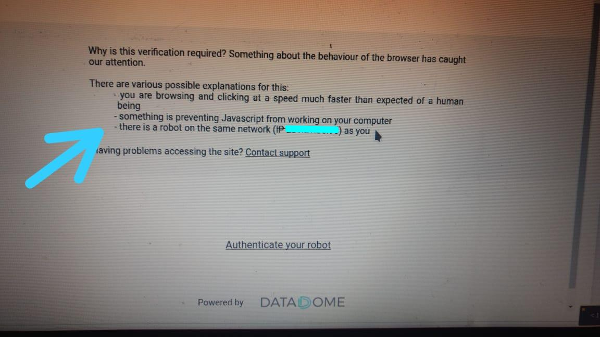

# Ruby Scrapping
> POC to improve screen scrapping and strategies to collect data

Highly based on this reddit [post](https://www.reddit.com/r/ruby/comments/9zck2o/web_scraping_webcast_video_will_blow_your_mind/).

## Thoughts

Improve how manipulate data and html with [Watir](http://watir.com/) and [Nokogiri](http://www.nokogiri.org/).

Be less intrusive..

## Meta

Alex Rocha - [about.me](http://about.me/alex.rochas)
